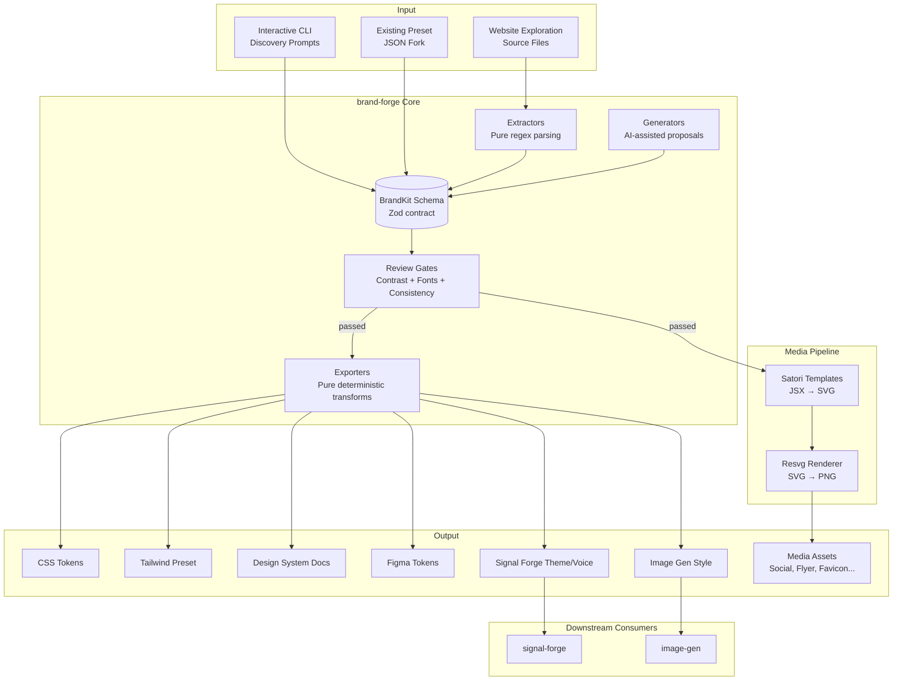
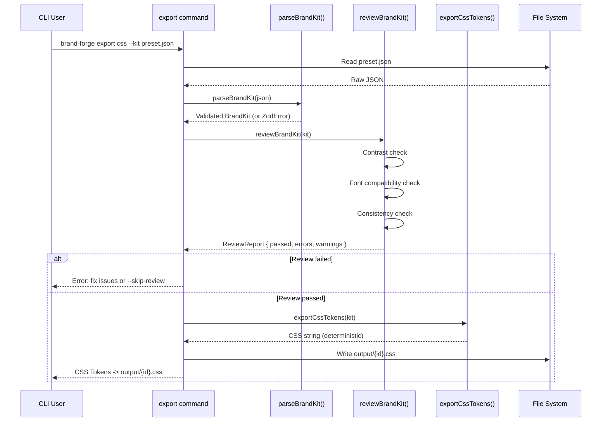
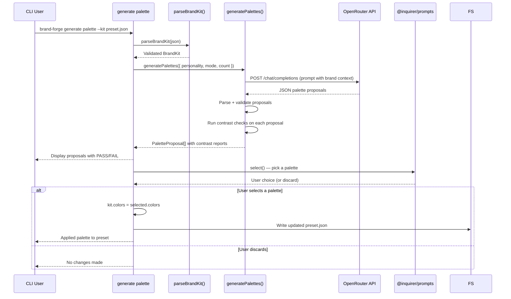

# Architecture Overview

> Auto-generated by Autonomous Knowledge Synthesis
> Last updated: 2026-03-24

## System Metaphor

brand-forge is a CLI-first design agency toolkit that treats a single JSON document — the Brand Kit — as the contract between creative exploration and production output. Every generator proposes changes to this contract, every review gate validates it, and every exporter deterministically serializes it into consumable formats. The system enforces a strict propose-validate-approve-lock lifecycle: AI suggests, rules check, humans decide, schema locks.

## Architectural Style

**Primary Pattern:** Pipeline Architecture with Schema-as-Contract

The codebase follows a unidirectional data pipeline where a Zod-validated `BrandKit` schema acts as the single source of truth. All modules — extractors, generators, review gates, exporters, and media renderers — operate on this schema as input or output. The pipeline enforces a separation between AI-assisted creative work (generators) and deterministic production output (exporters), with review gates as the mandatory checkpoint between the two.

## High-Level Structure

## Component Catalog

| Directory | Responsibility | Key Files | Dependencies |
|-----------|---------------|-----------|--------------|
| `src/core/schema/` | Zod type definitions for the BrandKit contract | `brand-kit.ts`, `color.ts`, `typography.ts`, `voice.ts`, `media.ts`, `spacing.ts` | `zod` |
| `src/core/extractors/` | Parse design tokens from website-exploration source files via regex | `colors.ts`, `typography.ts`, `spacing.ts`, `layout.ts`, `voice-hints.ts`, `utils.ts` | Schema types |
| `src/core/generators/` | AI-assisted creative proposals (palettes, voice, fonts, identity, logos) | `palette.ts`, `voice.ts`, `fonts.ts`, `identity.ts`, `logo.ts`, `provider.ts` | Schema, OpenRouter/Anthropic API |
| `src/core/review/` | QA gates that block export on failure | `contrast.ts`, `font-compat.ts`, `consistency.ts` | Schema, `chroma-js` |
| `src/core/exporters/` | Pure deterministic transforms from BrandKit to output formats | `css-tokens.ts`, `tailwind.ts`, `markdown.ts`, `signal-forge-theme.ts`, `signal-forge-voice.ts`, `image-gen-style.ts`, `figma-tokens.ts` | Schema types only |
| `src/media/renderer.ts` | Satori (JSX to SVG) + Resvg (SVG to PNG) render pipeline | `renderer.ts` | `satori`, `@resvg/resvg-js`, Google Fonts API |
| `src/media/templates/` | JSX template registry for branded media assets | `social-card.ts`, `story.ts`, `flyer.ts`, `favicon.ts`, `business-card.ts`, `email-header.ts`, `prescription-label.ts`, `heat-card.ts` | Schema types, React JSX |
| `src/media/creative/` | AI-driven media generation (logo iteration) | `logo-iterate.ts` (in generators) | OpenRouter API |
| `src/cli/commands/` | Commander command handlers that wire pipeline stages together | `init.ts`, `generate.ts`, `export.ts`, `media.ts`, `batch.ts`, `review.ts`, `diff.ts`, `site.ts` | All core modules |
| `src/site/starters/` | Static site starter templates generated from brand kits | — | Exporters output |
| `presets/` | Validated brand kit JSON files serving as saved configurations | `630volleyball.json`, `flickday.json`, `signal-dispatch.json`, `volley-rx.json`, `letspepper.json` | Must pass `parseBrandKit()` + `reviewBrandKit()` |
| `scripts/` | One-off iteration scripts for logo/brand refinement | `iterate-flickday*.ts` | Generators, renderer |
| `references/` | Design audit documents from external products (ChatPRD, Vercel, Resend, etc.) | 11 `.md` files | None (reference material) |

## Key Architectural Decisions

### Decision 1: Schema-as-Contract with Zod

- **Context:** The system produces outputs consumed by multiple downstream tools (signal-forge, image-gen, Figma). Without a shared contract, each tool would need its own parser and the system would drift.
- **Decision:** A single Zod schema (`BrandKit`) defines the complete brand identity. All input paths (init, generate, extract) must produce data that passes `parseBrandKit()`. All output paths (exporters, media) consume the validated type.
- **Alternatives Considered:** TypeScript interfaces alone (no runtime validation), JSON Schema (no TypeScript integration), freeform JSON with ad-hoc validation.
- **Evidence:** `src/core/schema/brand-kit.ts` — the `BrandKit` Zod object composes `ColorSystem`, `TypographySystem`, `VoiceSystem`, `MediaSystem`, `SpacingScale`, `RadiusScale`, and `LayoutConstraints`. Every CLI command loads via `parseBrandKit()`.
- **Consequences:** Adding a new brand dimension requires schema changes, which cascade to all presets and exporters. This is intentional — the schema is the single source of truth, and changes must be validated everywhere.

### Decision 2: Strict Purity Boundary Between Generators and Exporters

- **Context:** AI-generated outputs are non-deterministic and can produce invalid or low-quality results. Production outputs consumed by downstream tools must be deterministic and reliable.
- **Decision:** Generators (AI-assisted) and exporters (pure functions) are separated into distinct module groups with different rules. Generators propose; review gates validate; exporters transform. Exporters are explicitly forbidden from using AI, network calls, or randomness.
- **Alternatives Considered:** Single module that generates and exports in one step, generator output used directly without review.
- **Evidence:** `CLAUDE.md` rule 1: "Exporters are pure functions. No AI, no network, no randomness." Rule 2: "Generators propose. Review gates validate. Humans approve. Then it locks into the schema."
- **Consequences:** The human-in-the-loop approval step (via `@inquirer/prompts` in CLI commands) means generators cannot run unattended. The batch command only runs exporters and media — it does not invoke generators.

### Decision 3: OpenRouter as Primary AI Provider

- **Context:** The project needed an LLM provider for generators (palette, voice, fonts, identity, logos). Consistency with the sibling `image-gen` project was important.
- **Decision:** OpenRouter is the primary provider, with Anthropic direct and Vercel AI Gateway as fallbacks. The priority chain is: `OPENROUTER_API_KEY` > `ANTHROPIC_API_KEY` > `VERCEL_OIDC_TOKEN`.
- **Alternatives Considered:** Direct Anthropic only (no model variety), AI SDK as primary (adds dependency), multi-provider SDK.
- **Evidence:** `src/core/generators/provider.ts` — raw `fetch()` calls to OpenRouter and Anthropic APIs with a dynamic import fallback to `ai` package for Gateway.
- **Consequences:** No SDK dependency for the primary path — the `ai` package is optional. This keeps the dependency tree small but means no streaming, no structured output parsing, and manual error handling.

### Decision 4: Two-Tier Font Cache for Media Rendering

- **Context:** Satori requires actual font binary data (TTF) to render JSX to SVG. Fetching fonts from Google Fonts on every render is slow, especially in batch mode where multiple templates render the same brand.
- **Decision:** A two-tier cache: in-memory `Map` (survives within a process) and disk cache at `~/.brand-forge/fonts/` (survives across CLI invocations).
- **Alternatives Considered:** Memory-only cache (re-downloads across runs), pre-bundled fonts (too large, limited selection), local font files only (requires manual setup).
- **Evidence:** `src/media/renderer.ts:20-91` — `memoryCache`, `readDiskCache()`, `writeDiskCache()`, and `fetchGoogleFont()` implement the tiered strategy.
- **Consequences:** First render of a new font family is slow (network fetch). Subsequent renders are fast. The `~/.brand-forge/` directory grows over time but is per-family-weight so remains manageable.

## Data Flow: Brand Kit Export

## Data Flow: AI-Assisted Generation

## External Integrations

| Integration | Purpose | Location | Configuration |
|-------------|---------|----------|---------------|
| OpenRouter API | LLM calls for generators (palette, voice, fonts, identity) | `src/core/generators/provider.ts` | `OPENROUTER_API_KEY` env var |
| Anthropic API | Fallback LLM provider | `src/core/generators/provider.ts` | `ANTHROPIC_API_KEY` env var |
| Vercel AI Gateway | Optional LLM provider for Vercel-deployed usage | `src/core/generators/provider.ts` | `VERCEL_OIDC_TOKEN` env var |
| Google Fonts API | Font binary fetching for Satori media rendering | `src/media/renderer.ts` | None (public API) |
| OpenRouter Image API | Logo concept generation via image models | `src/core/generators/logo.ts` | `OPENROUTER_API_KEY` env var |

## Cross-Cutting Concerns

### Validation
Zod schema validation is the primary safety mechanism. Every brand kit is validated on load via `parseBrandKit()` (throws `ZodError` on invalid data) or `safeParseBrandKit()` (returns result object). The schema enforces `#rrggbb` color format, required fields, default values, and structural constraints.

### Review Gates
Three review gates run in sequence before any export:
1. **Contrast** (`contrast.ts`) — WCAG contrast ratio checks between text/background color pairs using `chroma-js`. Issues with severity `error` block export.
2. **Font Compatibility** (`font-compat.ts`) — Validates that font pairings work optically (e.g., serif + sans-serif is fine, two competing display faces is not).
3. **Consistency** (`consistency.ts`) — Checks internal coherence of the brand kit (e.g., spacing scale monotonicity, color system completeness).

### Error Handling
CLI commands use `process.exit(1)` for fatal errors (missing files, schema validation failures, failed reviews). Generator failures surface as thrown errors with descriptive messages including the HTTP status and response body. Non-fatal issues (disk cache write failures, skipped media templates) log warnings and continue.

### Configuration Management
No config files — the system uses environment variables for AI provider credentials (`OPENROUTER_API_KEY`, `ANTHROPIC_API_KEY`, `VERCEL_OIDC_TOKEN`) loaded via `dotenv/config` at CLI startup. Brand configuration lives entirely in the BrandKit JSON presets.

## Technical Constraints

- **ESM-only** — All imports use `.js` extension. The project uses `"type": "module"` in `package.json`.
- **No runtime dependency on downstream consumers** — brand-forge exports data files consumed by signal-forge and image-gen, but does not import from them. The dependency arrow is one-directional.
- **Satori JSX limitations** — Media templates use React JSX syntax but render via Satori, which supports only a subset of CSS (no CSS Grid, limited flexbox, no pseudo-elements). Templates must work within these constraints.
- **Font availability** — Media rendering depends on Google Fonts API availability. Fonts not on Google Fonts (e.g., Adobe Typekit) fall back to Inter.
- **Color format** — All colors must be `#rrggbb` (6-digit hex). Shorthand hex, RGB, HSL, and named colors are not supported by the schema.

## Areas of Complexity

| Area | Complexity Indicator | Risk Level |
|------|---------------------|------------|
| `src/cli/commands/init.ts` | 584 lines, dual-path logic (extraction + interactive discovery), extensive gap-filling prompts | Medium |
| `src/media/renderer.ts` | Two-tier caching with network fallback, font weight selection heuristics | Medium |
| `src/core/generators/provider.ts` | Three-provider fallback chain with different API shapes | Low |
| `src/cli/commands/generate.ts` | Five sub-commands, each with AI call + interactive approval | Low |
| `presets/` | 5 brand kits that must all pass `parseBrandKit()` + `reviewBrandKit()` on every schema change | Medium |

---

## Related Documentation

- [Developer Setup](../developer/README.md)
- [ADR Template](./decisions/template.md)
- [Diagram Index](./diagrams/README.md)
- [Audit Report](../audit-report.md)
